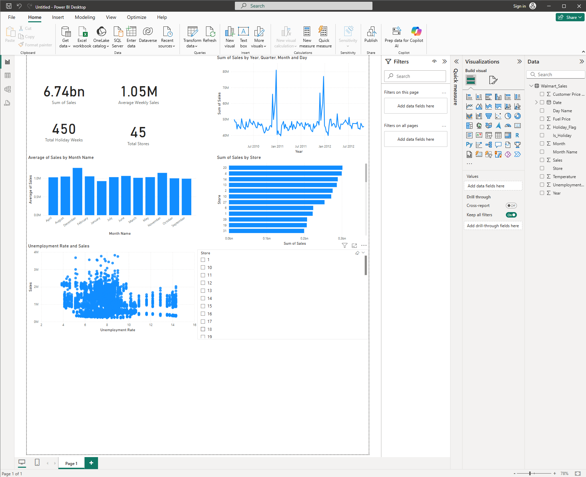

# 📊 Walmart Sales Analysis Dashboard – Power BI

This project showcases a fully interactive Power BI dashboard analyzing weekly sales data from Walmart stores across the U.S. The dashboard allows business users to explore trends, compare store performance, and assess the impact of holidays and economic conditions on sales.

---

## 📁 Dataset
- **Source**: `Walmart_Sales.csv`
- Weekly sales data from 45 Walmart stores over multiple years
- Includes holiday flags, temperature, fuel prices, CPI, and unemployment rates

---

## 🧼 Step 1: Load and Prepare the Dataset

1. Open Power BI and import the `Walmart_Sales.csv` file.
2. In Power Query Editor:
   - **Date Formatting**: Converted `Date` column using locale settings (English - UK) for correct DD-MM-YYYY parsing.
   - **New Columns**:
     - `Year`, `Month`, `Day of Week` (from the Date column)
     - `Is_Holiday` (custom column: `if [Holiday_Flag] = 1 then "Yes" else "No"`)
   - **Data Types Fixed**:
     - Converted `Unemployment`, `Fuel_Price`, `CPI`, and `Weekly_Sales` to Decimal
     - Changed `Store` to Text to treat it as a category
   - **Removed or Renamed** columns for clarity
3. Clicked **“Close & Apply”** to load the cleaned data for reporting.

---

## 🛠 Step 2: Build the Interactive Dashboard

Created a single-page, interactive dashboard using the cleaned data to answer key business questions.

### 📌 Visuals Included:

- **KPI Cards**:
  - Total Sales
  - Average Weekly Sales
  - Total Holiday Weeks
  - Total Stores

- **Line Chart** – *Sales Over Time*:
  - Shows seasonal trends and year-end spikes

- **Bar Chart** – *Sales by Store*:
  - Compares store-level performance

- **Column Chart** – *Average Sales by Month*:
  - Uses average (not total) to adjust for inconsistent week counts
  - Months sorted by custom `Month Number` column

- **Scatter Plot** – *Sales vs Unemployment Rate*:
  - Analyzes economic impact on revenue

- **Slicers**:
  - Year
  - Store
  - Is_Holiday (Yes/No)

---

## 💡 Business Insights

- 🎄 **Holiday weeks** consistently show elevated sales.
- 🏬 **Store 20** outperforms others year-over-year.
- 📉 **Sales slightly drop during periods of higher unemployment.**
- 📆 **July and November** exhibit stronger average weekly performance, even outside of holiday periods.

---

## 📂 Files Included

| File | Description |
|------|-------------|
| `Walmart_Sales_Analysis_Dashboard.pbix` | Power BI dashboard |
| `Walmart_Sales.csv` | Original dataset |
| `dashboard_screenshot.png` | Preview of the dashboard |

---

## 🚀 Why This Project Matters

This project demonstrates:
- ✅ **Data Cleaning & Modeling** using Power Query
- ✅ **Business-Oriented Analytics** with DAX and visuals
- ✅ **Interactive Storytelling** through a professional dashboard
- ✅ **Real-World Relevance** — connects data insights with business decisions

---

---

